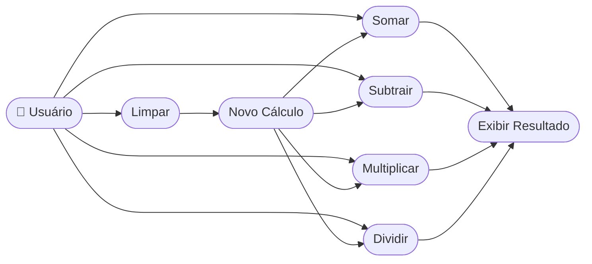

# 🔄 Casos de Uso (Use Cases)

## 👥 Atores

| Ator    | Descrição                                                     |
| ------- | ------------------------------------------------------------- |
| Usuário | Pessoa que utiliza o app para realizar cálculos aritméticos   |

## 📋 Casos de Uso (UC)

| ID   | Caso de Uso             | Ator Principal | Descrição                                              |
| ---- | ----------------------- | -------------- | ------------------------------------------------------ |
| UC01 | Somar dois números      | Usuário        | Usuário insere dois valores e toca em "+"              |
| UC02 | Subtrair dois números   | Usuário        | Usuário insere dois valores e toca em "−"              |
| UC03 | Multiplicar dois números| Usuário        | Usuário insere dois valores e toca em "×"              |
| UC04 | Dividir dois números    | Usuário        | Usuário insere dois valores e toca em "÷"              |
| UC05 | Limpar a calculadora    | Usuário        | Usuário toca em "C" para apagar campos e resultado     |
| UC06 | Realizar novo cálculo   | Usuário        | Após limpar, usuário insere novos valores e opera      |

---

## 📊 Diagrama de Casos de Uso

---

## 🛣️ Fluxos de Execução

### 📑 UC01 — Somar dois números

**Pré-condição:** App aberto na tela principal com os campos em branco.

**🟢 Fluxo principal:**
1. Usuário toca no campo "Digite o primeiro número" e digita `1`
2. Usuário toca no campo "Digite o segundo número" e digita `5`
3. Usuário toca no botão "+"
4. App converte os textos para números e calcula a soma
5. App exibe `6` abaixo de "RESULTADO:"

**🟡 Fluxo alternativo — recalcular sem limpar:**
1. Com o resultado `6` exibido, usuário altera o segundo campo para `10`
2. Usuário toca em "+" novamente
3. App recalcula e exibe `11`

**🔴 Fluxo de exceção — campo vazio:**
1. Usuário toca em "+" sem preencher um dos campos
2. App pode exibir resultado inválido ou `0` dependendo da validação implementada

**✅ Pós-condição:** O resultado da soma é exibido em "RESULTADO:"

---

### 📑 UC04 — Dividir dois números

**Pré-condição:** App com dois números inseridos.

**🟢 Fluxo principal:**
1. Usuário insere `1` no primeiro campo e `5` no segundo
2. Usuário toca em "÷"
3. App calcula e exibe `0.2` em "RESULTADO:"

**🔴 Fluxo de exceção — divisão por zero:**
1. Usuário insere qualquer número no primeiro campo e `0` no segundo
2. Usuário toca em "÷"
3. App exibe erro ou valor indefinido (comportamento dependente da versão)

**✅ Pós-condição:** O quociente com suporte a casas decimais é exibido.

---

### 📑 UC05 — Limpar a calculadora

**Pré-condição:** Campos preenchidos e/ou resultado visível.

**🟢 Fluxo principal:**
1. Usuário toca no botão "C"
2. App apaga o conteúdo dos dois campos de entrada
3. App apaga o resultado exibido
4. Campos voltam a mostrar os textos de placeholder

**✅ Pós-condição:** App retorna ao estado inicial pronto para novo cálculo.
