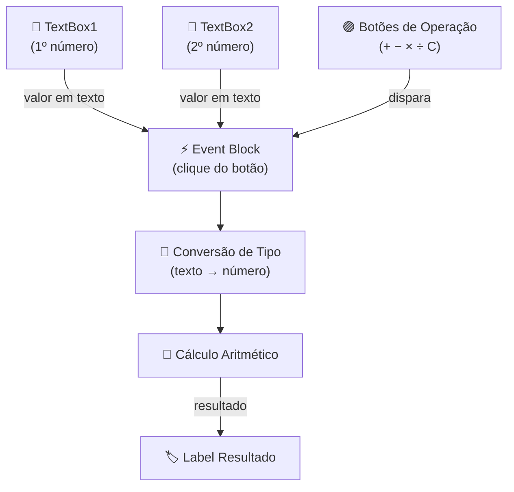

# 🏛️ Visão Geral da Arquitetura

## 📌 Contexto

A **Calculadora Simples** é um aplicativo Android de tela única desenvolvido no **Kodular** —
plataforma de desenvolvimento visual baseada em blocos. Toda a lógica de cálculo e interação
é construída graficamente, sem código nativo.

A interface foi prototipada no **Figma** antes da implementação no Kodular.

---

## 🗂️ Camadas do App

| Camada           | Responsabilidade                                                | Componentes Kodular              |
| ---------------- | --------------------------------------------------------------- | -------------------------------- |
| Interface (UI)   | Campos de entrada, botões de operação e exibição do resultado   | TextBox, Button, Label           |
| Lógica de evento | Captura clique do operador, converte entradas e calcula         | Event Blocks (clique de botão)   |
| Conversão        | Transforma texto digitado em número antes de operar            | Bloco `number` / `parse number`  |
| Exibição         | Atualiza o label de resultado com o valor calculado             | Label (propriedade `.Text`)      |

---

## 📊 Diagrama de componentes

---

## 🖥️ Componentes da Tela

| Componente         | Tipo     | Função                                           |
| ------------------ | -------- | ------------------------------------------------ |
| TextBox1           | TextBox  | Entrada do primeiro operando                     |
| TextBox2           | TextBox  | Entrada do segundo operando                      |
| BotaoSoma          | Button   | Dispara cálculo de adição                        |
| BotaoSubtracao     | Button   | Dispara cálculo de subtração                     |
| BotaoMultiplicacao | Button   | Dispara cálculo de multiplicação                 |
| BotaoDivisao       | Button   | Dispara cálculo de divisão                       |
| BotaoLimpar        | Button   | Limpa campos e resultado (botão "C")             |
| LabelResultado     | Label    | Exibe "RESULTADO:" seguido do valor calculado    |

---

## 📦 Padrões adotados

| Padrão                        | Onde é aplicado                                               |
| ----------------------------- | ------------------------------------------------------------- |
| Tela única (Single Screen)    | Todo o app funciona em uma única Screen do Kodular            |
| Cálculo imediato (no-equals)  | Resultado exibido no clique do operador, sem botão "="        |
| Conversão explícita de tipo   | TextBox retorna string; conversão para número antes de operar |
| Reset de estado               | Botão C limpa todos os campos e o label de resultado          |
